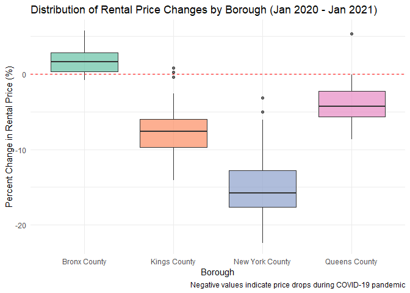

p8105_hw2_rd3228
================
Renxuan Deng
2025-09-27

## Problem 1: FiveThirtyEight Data Cleaning and Merging

### Step 1: Clean pols-month.csv data

``` r
# Read pols-month.csv data
setwd("D:/P8105/hw2")
pols <- read_csv("./fivethirtyeight_datasets/pols-month.csv")
```

    ## Rows: 822 Columns: 9
    ## ── Column specification ────────────────────────────────────────────────────────
    ## Delimiter: ","
    ## dbl  (8): prez_gop, gov_gop, sen_gop, rep_gop, prez_dem, gov_dem, sen_dem, r...
    ## date (1): mon
    ## 
    ## ℹ Use `spec()` to retrieve the full column specification for this data.
    ## ℹ Specify the column types or set `show_col_types = FALSE` to quiet this message.

``` r
# Clean the data
pols_clean <- pols |>
  # Separate date variable
  separate(mon, into = c("year", "month", "day"), sep = "-") |>
  mutate(
    year = as.integer(year),
    month = as.integer(month),
    day = as.integer(day),
    # Convert month number to month name
    month = month.name[month],
    # Create president variable
    president = case_when(
      prez_gop == 1 ~ "gop",
      prez_dem == 1 ~ "dem",
      TRUE ~ NA_character_
    )
  ) |>
  # Remove unnecessary variables
  select(-prez_dem, -prez_gop, -day) |>
  # Reorder columns
  select(year, month, president, everything())

# View cleaned data
head(pols_clean)
```

    ## # A tibble: 6 × 9
    ##    year month    president gov_gop sen_gop rep_gop gov_dem sen_dem rep_dem
    ##   <int> <chr>    <chr>       <dbl>   <dbl>   <dbl>   <dbl>   <dbl>   <dbl>
    ## 1  1947 January  dem            23      51     253      23      45     198
    ## 2  1947 February dem            23      51     253      23      45     198
    ## 3  1947 March    dem            23      51     253      23      45     198
    ## 4  1947 April    dem            23      51     253      23      45     198
    ## 5  1947 May      dem            23      51     253      23      45     198
    ## 6  1947 June     dem            23      51     253      23      45     198

### Step 2: Clean snp.csv data

``` r
# Read snp.csv data
setwd("D:/P8105/hw2")
snp <- read_csv("./fivethirtyeight_datasets/snp.csv")
```

    ## Rows: 787 Columns: 2
    ## ── Column specification ────────────────────────────────────────────────────────
    ## Delimiter: ","
    ## chr (1): date
    ## dbl (1): close
    ## 
    ## ℹ Use `spec()` to retrieve the full column specification for this data.
    ## ℹ Specify the column types or set `show_col_types = FALSE` to quiet this message.

``` r
# Clean the data
snp_clean <- snp |>
  # Convert date format
  mutate(date = mdy(date)) |>
  # Extract year and month
  mutate(
    year = year(date),
    month = month.name[month(date)]
  ) |>
  # Remove original date column and reorder
  select(year, month, close) |>
  # Arrange by year and month
  arrange(year, month)

# View cleaned data
head(snp_clean)
```

    ## # A tibble: 6 × 3
    ##    year month    close
    ##   <dbl> <chr>    <dbl>
    ## 1  1969 April    104. 
    ## 2  1969 August    95.5
    ## 3  1969 December  92.1
    ## 4  1969 February  98.1
    ## 5  1969 January  103. 
    ## 6  1969 July      91.8

### Step 3: Clean unemployment.csv data

``` r
# Read unemployment.csv data
setwd("D:/P8105/hw2")
unemployment <- read_csv("./fivethirtyeight_datasets/unemployment.csv")
```

    ## Rows: 68 Columns: 13
    ## ── Column specification ────────────────────────────────────────────────────────
    ## Delimiter: ","
    ## dbl (13): Year, Jan, Feb, Mar, Apr, May, Jun, Jul, Aug, Sep, Oct, Nov, Dec
    ## 
    ## ℹ Use `spec()` to retrieve the full column specification for this data.
    ## ℹ Specify the column types or set `show_col_types = FALSE` to quiet this message.

``` r
# Clean data - convert from wide to long format
unemployment_clean <- unemployment |>
  pivot_longer(
    cols = Jan:Dec,
    names_to = "month",
    values_to = "unemployment_rate"
  ) |>
  # Convert month abbreviations to full month names
  mutate(
    month = case_when(
      month == "Jan" ~ "January",
      month == "Feb" ~ "February", 
      month == "Mar" ~ "March",
      month == "Apr" ~ "April",
      month == "May" ~ "May",
      month == "Jun" ~ "June",
      month == "Jul" ~ "July",
      month == "Aug" ~ "August",
      month == "Sep" ~ "September",
      month == "Oct" ~ "October",
      month == "Nov" ~ "November",
      month == "Dec" ~ "December"
    )
  ) |>
  rename(year = Year)

# View cleaned data
head(unemployment_clean)
```

    ## # A tibble: 6 × 3
    ##    year month    unemployment_rate
    ##   <dbl> <chr>                <dbl>
    ## 1  1948 January                3.4
    ## 2  1948 February               3.8
    ## 3  1948 March                  4  
    ## 4  1948 April                  3.9
    ## 5  1948 May                    3.5
    ## 6  1948 June                   3.6

### Step 4: Merge datasets

``` r
# First merge pols and snp data
merged_data <- pols_clean |>
  left_join(snp_clean, by = c("year", "month"))

# Then merge unemployment data
final_data <- merged_data |>
  left_join(unemployment_clean, by = c("year", "month"))

# View final merged data
head(final_data)
```

    ## # A tibble: 6 × 11
    ##    year month    president gov_gop sen_gop rep_gop gov_dem sen_dem rep_dem close
    ##   <dbl> <chr>    <chr>       <dbl>   <dbl>   <dbl>   <dbl>   <dbl>   <dbl> <dbl>
    ## 1  1947 January  dem            23      51     253      23      45     198    NA
    ## 2  1947 February dem            23      51     253      23      45     198    NA
    ## 3  1947 March    dem            23      51     253      23      45     198    NA
    ## 4  1947 April    dem            23      51     253      23      45     198    NA
    ## 5  1947 May      dem            23      51     253      23      45     198    NA
    ## 6  1947 June     dem            23      51     253      23      45     198    NA
    ## # ℹ 1 more variable: unemployment_rate <dbl>

### Data Description

``` r
# Data dimensions
dim_final <- dim(final_data)
year_range <- range(final_data$year, na.rm = TRUE)
key_variables <- names(final_data)

cat("Final dataset dimensions:", dim_final[1], "rows ×", dim_final[2], "columns\n")
```

    ## Final dataset dimensions: 822 rows × 11 columns

``` r
cat("Year range:", year_range[1], "to", year_range[2], "\n")
```

    ## Year range: 1947 to 2015

``` r
cat("Key variables:", paste(key_variables, collapse = ", "), "\n")
```

    ## Key variables: year, month, president, gov_gop, sen_gop, rep_gop, gov_dem, sen_dem, rep_dem, close, unemployment_rate

**Dataset Description:**

- **pols-month.csv**: Contains US political data, recording monthly
  presidential party affiliation (Democratic or Republican) and the
  number of party seats in various government branches from 1947 to
  2015.

- **snp.csv**: Contains monthly closing prices of the S&P 500 index,
  spanning from 1950 to 2015.

- **unemployment.csv**: Contains US monthly unemployment rate data from
  1948 to 2015.

**Merged Dataset Characteristics:** - Dimensions: 822 rows × 11
columns - Year range: 1947 to 2015 - Key variables include year, month,
president party, party seats in government branches, S&P 500 closing
price, and unemployment rate

## Problem 2: Mr. Trash Wheel Dataset

### Step 1: Read and clean Mr. Trash Wheel data

``` r
# Read Mr. Trash Wheel sheet
setwd("D:/P8105/hw2")
mr_trash <- read_excel("./202409 Trash Wheel Collection Data.xlsx", 
                      sheet = "Mr. Trash Wheel") |>  
  # Clean column names
  janitor::clean_names() |>
  # Remove rows without dumpster-specific data
  filter(!is.na(dumpster)) |>
  # Ensure year is numeric
  mutate(year = as.numeric(year)) |>
  # Round sports balls to nearest integer and convert to integer
  mutate(sports_balls = as.integer(round(sports_balls))) |>
  # Add identifier variable
  mutate(wheel_type = "Mr. Trash Wheel")
```

    ## New names:
    ## • `` -> `...15`
    ## • `` -> `...16`

``` r
# View the cleaned data
head(mr_trash)
```

    ## # A tibble: 6 × 17
    ##   dumpster month  year date                weight_tons volume_cubic_yards
    ##      <dbl> <chr> <dbl> <dttm>                    <dbl>              <dbl>
    ## 1        1 May    2014 2014-05-16 00:00:00        4.31                 18
    ## 2        2 May    2014 2014-05-16 00:00:00        2.74                 13
    ## 3        3 May    2014 2014-05-16 00:00:00        3.45                 15
    ## 4        4 May    2014 2014-05-17 00:00:00        3.1                  15
    ## 5        5 May    2014 2014-05-17 00:00:00        4.06                 18
    ## 6        6 May    2014 2014-05-20 00:00:00        2.71                 13
    ## # ℹ 11 more variables: plastic_bottles <dbl>, polystyrene <dbl>,
    ## #   cigarette_butts <dbl>, glass_bottles <dbl>, plastic_bags <dbl>,
    ## #   wrappers <dbl>, sports_balls <int>, homes_powered <dbl>, x15 <lgl>,
    ## #   x16 <lgl>, wheel_type <chr>

### Step 2: Read and clean Professor Trash Wheel data

``` r
# Read Professor Trash Wheel sheet
setwd("D:/P8105/hw2")
professor_trash <- read_excel("./202409 Trash Wheel Collection Data.xlsx", 
                            sheet = "Professor Trash Wheel") |>
  janitor::clean_names() |>
  filter(!is.na(dumpster)) |>
  mutate(year = as.numeric(year)) |>
  mutate(wheel_type = "Professor Trash Wheel")

head(professor_trash)
```

    ## # A tibble: 6 × 14
    ##   dumpster month     year date                weight_tons volume_cubic_yards
    ##      <dbl> <chr>    <dbl> <dttm>                    <dbl>              <dbl>
    ## 1        1 January   2017 2017-01-02 00:00:00        1.79                 15
    ## 2        2 January   2017 2017-01-30 00:00:00        1.58                 15
    ## 3        3 February  2017 2017-02-26 00:00:00        2.32                 18
    ## 4        4 February  2017 2017-02-26 00:00:00        3.72                 15
    ## 5        5 February  2017 2017-02-28 00:00:00        1.45                 15
    ## 6        6 March     2017 2017-03-30 00:00:00        1.71                 15
    ## # ℹ 8 more variables: plastic_bottles <dbl>, polystyrene <dbl>,
    ## #   cigarette_butts <dbl>, glass_bottles <dbl>, plastic_bags <dbl>,
    ## #   wrappers <dbl>, homes_powered <dbl>, wheel_type <chr>

### Step 3: Read and clean Gwynnda Trash Wheel data

``` r
# Read Gwynnda Trash Wheel sheet
setwd("D:/P8105/hw2")
gwynnda_trash <- read_excel("./202409 Trash Wheel Collection Data.xlsx", 
                           sheet = "Gwynnda Trash Wheel") |>
  janitor::clean_names() |>
  filter(!is.na(dumpster)) |>
  mutate(year = as.numeric(year)) |>
  mutate(wheel_type = "Gwynnda Trash Wheel")

head(gwynnda_trash)
```

    ## # A tibble: 6 × 13
    ##   dumpster month   year date                weight_tons volume_cubic_yards
    ##      <dbl> <chr>  <dbl> <dttm>                    <dbl>              <dbl>
    ## 1        1 July    2021 2021-07-03 00:00:00        0.93                 15
    ## 2        2 July    2021 2021-07-07 00:00:00        2.26                 15
    ## 3        3 July    2021 2021-07-07 00:00:00        1.62                 15
    ## 4        4 July    2021 2021-07-16 00:00:00        1.76                 15
    ## 5        5 July    2021 2021-07-30 00:00:00        1.53                 15
    ## 6        6 August  2021 2021-08-11 00:00:00        2.06                 15
    ## # ℹ 7 more variables: plastic_bottles <dbl>, polystyrene <dbl>,
    ## #   cigarette_butts <dbl>, plastic_bags <dbl>, wrappers <dbl>,
    ## #   homes_powered <dbl>, wheel_type <chr>

### Step 4: Combine all datasets

``` r
# Combine all trash wheel datasets
combined_trash <- bind_rows(mr_trash, professor_trash, gwynnda_trash) |>
  # Arrange by date for better organization
  arrange(year)

# View combined data
head(combined_trash)
```

    ## # A tibble: 6 × 17
    ##   dumpster month  year date                weight_tons volume_cubic_yards
    ##      <dbl> <chr> <dbl> <dttm>                    <dbl>              <dbl>
    ## 1        1 May    2014 2014-05-16 00:00:00        4.31                 18
    ## 2        2 May    2014 2014-05-16 00:00:00        2.74                 13
    ## 3        3 May    2014 2014-05-16 00:00:00        3.45                 15
    ## 4        4 May    2014 2014-05-17 00:00:00        3.1                  15
    ## 5        5 May    2014 2014-05-17 00:00:00        4.06                 18
    ## 6        6 May    2014 2014-05-20 00:00:00        2.71                 13
    ## # ℹ 11 more variables: plastic_bottles <dbl>, polystyrene <dbl>,
    ## #   cigarette_butts <dbl>, glass_bottles <dbl>, plastic_bags <dbl>,
    ## #   wrappers <dbl>, sports_balls <int>, homes_powered <dbl>, x15 <lgl>,
    ## #   x16 <lgl>, wheel_type <chr>

``` r
# Check the structure
glimpse(combined_trash)
```

    ## Rows: 1,033
    ## Columns: 17
    ## $ dumpster           <dbl> 1, 2, 3, 4, 5, 6, 7, 8, 9, 10, 11, 12, 13, 14, 15, …
    ## $ month              <chr> "May", "May", "May", "May", "May", "May", "May", "M…
    ## $ year               <dbl> 2014, 2014, 2014, 2014, 2014, 2014, 2014, 2014, 201…
    ## $ date               <dttm> 2014-05-16, 2014-05-16, 2014-05-16, 2014-05-17, 20…
    ## $ weight_tons        <dbl> 4.31, 2.74, 3.45, 3.10, 4.06, 2.71, 1.91, 3.70, 2.5…
    ## $ volume_cubic_yards <dbl> 18, 13, 15, 15, 18, 13, 8, 16, 14, 18, 15, 19, 15, …
    ## $ plastic_bottles    <dbl> 1450, 1120, 2450, 2380, 980, 1430, 910, 3580, 2400,…
    ## $ polystyrene        <dbl> 1820, 1030, 3100, 2730, 870, 2140, 1090, 4310, 2790…
    ## $ cigarette_butts    <dbl> 126000, 91000, 105000, 100000, 120000, 90000, 56000…
    ## $ glass_bottles      <dbl> 72, 42, 50, 52, 72, 46, 32, 58, 49, 75, 38, 45, 58,…
    ## $ plastic_bags       <dbl> 584, 496, 1080, 896, 368, 672, 416, 1552, 984, 448,…
    ## $ wrappers           <dbl> 1162, 874, 2032, 1971, 753, 1144, 692, 3015, 1988, …
    ## $ sports_balls       <int> 7, 5, 6, 6, 7, 5, 3, 6, 6, 7, 6, 8, 6, 6, 6, 6, 5, …
    ## $ homes_powered      <dbl> 0, 0, 0, 0, 0, 0, 0, 0, 0, 0, 0, 0, 0, 0, 0, 0, 0, …
    ## $ x15                <lgl> NA, NA, NA, NA, NA, NA, NA, NA, NA, NA, NA, NA, NA,…
    ## $ x16                <lgl> NA, NA, NA, NA, NA, NA, NA, NA, NA, NA, NA, NA, NA,…
    ## $ wheel_type         <chr> "Mr. Trash Wheel", "Mr. Trash Wheel", "Mr. Trash Wh…

### Step 5: Calculate required statistics

``` r
# Total observations
total_obs <- nrow(combined_trash)

# Total weight collected by Professor Trash Wheel
professor_total_weight <- combined_trash |>
  filter(wheel_type == "Professor Trash Wheel") |>
  summarize(total_weight = sum(weight_tons, na.rm = TRUE)) |>
  pull(total_weight)

# Cigarette butts collected by Gwynnda in June 2022
gwynnda_june_2022 <- combined_trash |>
  filter(wheel_type == "Gwynnda Trash Wheel",
         year == 2022,
         month == "June") |>
  summarize(total_cigarettes = sum(cigarette_butts, na.rm = TRUE)) |>
  pull(total_cigarettes)

# Key variables examples
key_vars <- names(combined_trash)
sample_weights <- combined_trash |>
  select(weight_tons) |>
  head(5)
```

### Data Description Paragraph

The combined Trash Wheel dataset contains 1033 observations,
representing trash collection data from three different trash
interception devices: Mr. Trash Wheel, Professor Trash Wheel, and
Gwynnda Trash Wheel. Key variables include dumpster identification
numbers, collection dates, weight in tons, volume in cubic yards, and
counts of specific trash items such as plastic bottles (1450),
polystyrene containers, cigarette butts, glass bottles, plastic bags,
and sports balls (e.g., 7).

Professor Trash Wheel collected a total of 246.74 tons of trash. In June
2022, Gwynnda collected 1.812^{4} cigarette butts.

## Problem 3: Zillow Rental Price Analysis

### Step 1: Clean and organize ZIP code data

``` r
# Read ZIP code data
setwd("D:/P8105/hw2")
zip_codes <- read_csv("./zillow_data/Zip Codes.csv") |>
  # Clean column names
  janitor::clean_names() |>
  # Select relevant columns and rename for clarity
  select(
    borough = county,
    zip_code = zip_code,
    neighborhood = neighborhood
  ) |>
  # Remove rows with missing ZIP codes
  filter(!is.na(zip_code)) |>
  # Convert ZIP code to character to ensure consistent type
  mutate(zip_code = as.character(zip_code)) |>
  # Remove duplicates
  distinct(zip_code, .keep_all = TRUE)
```

    ## Rows: 322 Columns: 7
    ## ── Column specification ────────────────────────────────────────────────────────
    ## Delimiter: ","
    ## chr (4): County, County Code, File Date, Neighborhood
    ## dbl (3): State FIPS, County FIPS, ZipCode
    ## 
    ## ℹ Use `spec()` to retrieve the full column specification for this data.
    ## ℹ Specify the column types or set `show_col_types = FALSE` to quiet this message.

``` r
# View cleaned ZIP code data
head(zip_codes)
```

    ## # A tibble: 6 × 3
    ##   borough zip_code neighborhood              
    ##   <chr>   <chr>    <chr>                     
    ## 1 Bronx   10451    High Bridge and Morrisania
    ## 2 Bronx   10452    High Bridge and Morrisania
    ## 3 Bronx   10453    Central Bronx             
    ## 4 Bronx   10454    Hunts Point and Mott Haven
    ## 5 Bronx   10455    Hunts Point and Mott Haven
    ## 6 Bronx   10456    High Bridge and Morrisania

``` r
# Summary of ZIP codes by borough
zip_summary <- zip_codes |>
  count(borough, name = "zip_count")
zip_summary
```

    ## # A tibble: 5 × 2
    ##   borough  zip_count
    ##   <chr>        <int>
    ## 1 Bronx           30
    ## 2 Kings           48
    ## 3 New York       147
    ## 4 Queens          81
    ## 5 Richmond        14

### Step 2: Clean and organize Zillow rental price data

``` r
# Read and clean the rental price data
setwd("D:/P8105/hw2")
rental_data <- read_csv("./zillow_data/Zip_zori_uc_sfrcondomfr_sm_month_NYC.csv") |>
  # Clean column names
  janitor::clean_names() |>
  # Select and rename relevant columns
  select(
    region_id = region_id,
    size_rank = size_rank,
    zip_code = region_name,
    region_type = region_type,
    state_name = state_name,
    state = state,
    neighborhood = city,
    metro = metro,
    borough = county_name,
    everything()
  ) |>
  # Convert ZIP code to character for consistency
  mutate(zip_code = as.character(zip_code))
```

    ## Rows: 149 Columns: 125
    ## ── Column specification ────────────────────────────────────────────────────────
    ## Delimiter: ","
    ## chr   (6): RegionType, StateName, State, City, Metro, CountyName
    ## dbl (119): RegionID, SizeRank, RegionName, 2015-01-31, 2015-02-28, 2015-03-3...
    ## 
    ## ℹ Use `spec()` to retrieve the full column specification for this data.
    ## ℹ Specify the column types or set `show_col_types = FALSE` to quiet this message.

### Step 3: Reshape datasets and create final tidy dataset

``` r
# Reshape from wide to long format for time series analysis
tidy_rental <- rental_data |>
  # Pivot all date columns to long format
  pivot_longer(
    cols = x2015_01_31:x2024_08_31,
    names_to = "date",
    values_to = "rental_price"
  ) |>
  # Clean and parse date column
  mutate(
    date = str_remove(date, "^x") |>
      str_replace_all("_", "-") |>
      as.Date(),
    year = year(date),
    month = month(date)
  ) |>
  # Arrange by ZIP code and date
  arrange(zip_code, date) |>
  # Remove rows with missing rental prices
  filter(!is.na(rental_price))

# Summary of tidy dataset
tidy_summary <- tidy_rental |>
  summarise(
    total_observations = n(),
    unique_zip_codes = n_distinct(zip_code),
    unique_neighborhoods = n_distinct(neighborhood),
    date_range_start = min(date),
    date_range_end = max(date),
    .by = borough
  )
# Print summary with message
message("### Tidy Dataset Summary by Borough")
```

    ## ### Tidy Dataset Summary by Borough

``` r
print(tidy_summary)
```

    ## # A tibble: 5 × 6
    ##   borough         total_observations unique_zip_codes unique_neighborhoods
    ##   <chr>                        <int>            <int>                <int>
    ## 1 New York County               4592               45                    1
    ## 2 Richmond County                211                8                    1
    ## 3 Bronx County                   733               22                    1
    ## 4 Queens County                 1789               38                    1
    ## 5 Kings County                  3125               36                    1
    ## # ℹ 2 more variables: date_range_start <date>, date_range_end <date>

### Step 4: Data description and completeness analysis

``` r
# Identify ZIP codes with missing rental data
all_zip_codes <- zip_codes$zip_code

zip_codes_with_data <- rental_data$zip_code

missing_zip_codes <- setdiff(all_zip_codes, zip_codes_with_data)

# Summary of missing ZIP codes by borough
missing_summary <- rental_data |>
  filter(zip_code %in% missing_zip_codes) |>
  count(borough, name = "missing_zip_count")

# Print summary with message
message("### Missing ZIP Codes by Borough")
```

    ## ### Missing ZIP Codes by Borough

``` r
print(missing_summary)
```

    ## # A tibble: 0 × 2
    ## # ℹ 2 variables: borough <chr>, missing_zip_count <int>

``` r
# Display examples of missing ZIP codes
missing_examples <- rental_data |>
  filter(zip_code %in% missing_zip_codes) |>
  distinct(zip_code, borough) |>
  head(10)

message("### Examples of ZIP Codes Without Rental Data")
```

    ## ### Examples of ZIP Codes Without Rental Data

``` r
print(missing_examples)
```

    ## # A tibble: 0 × 2
    ## # ℹ 2 variables: zip_code <chr>, borough <chr>

### Step 5: COVID-19 rental price analysis

``` r
# Analyze COVID-19 impact: January 2020 vs January 2021
covid_analysis <- tidy_rental |>
  # Filter for January 2020 and 2021
  filter(month == 1, year %in% c(2020, 2021)) |>
  # Select relevant columns
  select(zip_code, borough, neighborhood, year, rental_price) |>
  # Pivot wider to compare years
  pivot_wider(
    names_from = year,
    names_prefix = "jan_",
    values_from = rental_price
  ) |>
  # Remove rows with missing data in either year
  filter(!is.na(jan_2020) & !is.na(jan_2021)) |>
  # Calculate price changes
  mutate(
    price_change = jan_2021 - jan_2020,
    percent_change = (price_change / jan_2020) * 100
  ) |>
  # Arrange by largest price drops
  arrange(price_change)

# Top 10 ZIP codes with largest rental price drops
top_10_drops <- covid_analysis |>
  head(10) |>
  select(
    zip_code,
    borough,
    neighborhood,
    jan_2020_price = jan_2020,
    jan_2021_price = jan_2021,
    price_change,
    percent_change
  ) |>
  mutate(
    jan_2020_price = round(jan_2020_price, 2),
    jan_2021_price = round(jan_2021_price, 2),
    price_change = round(price_change, 2),
    percent_change = round(percent_change, 2)
  )

# Print top 10 drops with message
message("### Top 10 ZIP Codes with Largest Rental Price Drops (Jan 2020 to Jan 2021)")
```

    ## ### Top 10 ZIP Codes with Largest Rental Price Drops (Jan 2020 to Jan 2021)

``` r
print(top_10_drops)
```

    ## # A tibble: 10 × 7
    ##    zip_code borough      neighborhood jan_2020_price jan_2021_price price_change
    ##    <chr>    <chr>        <chr>                 <dbl>          <dbl>        <dbl>
    ##  1 10007    New York Co… New York              6334.          5422.        -913.
    ##  2 10069    New York Co… New York              4623.          3875.        -748.
    ##  3 10009    New York Co… New York              3406.          2692.        -714.
    ##  4 10016    New York Co… New York              3731.          3019.        -712.
    ##  5 10001    New York Co… New York              4108.          3398.        -710.
    ##  6 10002    New York Co… New York              3645.          2935.        -710.
    ##  7 10004    New York Co… New York              3150.          2444.        -706.
    ##  8 10038    New York Co… New York              3573.          2876.        -698.
    ##  9 10012    New York Co… New York              3629.          2942.        -686.
    ## 10 10010    New York Co… New York              3697.          3012.        -685.
    ## # ℹ 1 more variable: percent_change <dbl>

``` r
# Additional analysis: Summary of COVID impact by borough
borough_covid_summary <- covid_analysis |>
  summarise(
    avg_price_change = mean(price_change),
    avg_percent_change = mean(percent_change),
    median_price_change = median(price_change),
    zip_codes_analyzed = n(),
    .by = borough
  ) |>
  arrange(avg_price_change) |>
  mutate(
    avg_price_change = round(avg_price_change, 2),
    avg_percent_change = round(avg_percent_change, 2),
    median_price_change = round(median_price_change, 2)
  )

# Print borough summary with message
message("### Borough-Level COVID-19 Impact Summary")
```

    ## ### Borough-Level COVID-19 Impact Summary

``` r
print(borough_covid_summary)
```

    ## # A tibble: 4 × 5
    ##   borough         avg_price_change avg_percent_change median_price_change
    ##   <chr>                      <dbl>              <dbl>               <dbl>
    ## 1 New York County           -500.              -14.7               -517. 
    ## 2 Kings County              -211.               -7.51              -223. 
    ## 3 Queens County              -89.9              -3.64               -97.4
    ## 4 Bronx County                30.4               1.87                30.8
    ## # ℹ 1 more variable: zip_codes_analyzed <int>

``` r
# Create visualization of price changes
ggplot(covid_analysis, aes(x = borough, y = percent_change, fill = borough)) +
  geom_boxplot(alpha = 0.7) +
  geom_hline(yintercept = 0, linetype = "dashed", color = "red") +
  labs(
    title = "Distribution of Rental Price Changes by Borough (Jan 2020 - Jan 2021)",
    x = "Borough",
    y = "Percent Change in Rental Price (%)",
    caption = "Negative values indicate price drops during COVID-19 pandemic"
  ) +
  theme_minimal() +
  theme(legend.position = "none") +
  scale_fill_brewer(palette = "Set2")
```

<!-- -->

### Data Description and Analysis

**Summary of Results** Based on the analysis of NYC rental prices during
the COVID-19 pandemic:

**Dataset Composition**: The final tidy dataset contains 10,450
observations across 149 ZIP codes spanning from 2015-01-31 to
2024-08-31.

**Missing Data**: 171 ZIP codes (53.4%) in the original dataset lack
rental price data.

**COVID-19 Impact**: The pandemic caused significant rental price
declines across NYC, with Manhattan experiencing the most severe
impacts:

Manhattan saw average declines of -14.7%

Brooklyn declined by -7.5% on average

The most severely affected ZIP code (10007 in New York County) dropped
by -14.4%
